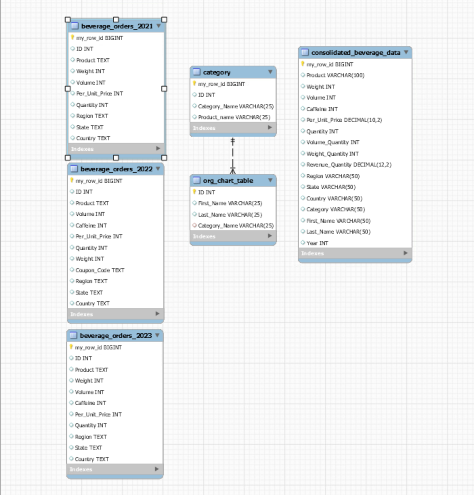

# Beverage Sales ETL Data Mart
## 📌 Overview
This project implements an end-to-end ETL pipeline using SQL to transform raw beverage order data from multiple years into a structured, analysis-ready data mart.

The goal was to standardize inconsistent datasets, compute key business metrics, and enable reporting on product performance, regional trends, and leadership accountability.

---

## 🛠️ Tech Stack
- SQL (MySQL)
- MySQL Workbench
- Data Modeling (ERD)
- CSV Data Processing

---

## 📂 Project Structure

```
beverage-sales-etl-data-mart/
│
├── data/
│   ├── Beverage_orders_2021.csv
│   ├── Beverage_orders_2022.csv
│   ├── Beverage_orders_2023.csv
│
├── sql/
│   ├── Beverage_ETL_Script.sql
│
├── output/
│   ├── output_final.csv
│
├── docs/
│   ├── ERD.png
│   ├── Business Memo and Appendix.pdf
│
└── README.md
```


---

## 🔄 ETL Pipeline

### 1. Extract
- Imported raw CSV files into MySQL tables
- Separate tables created for each year (2021–2023)

### 2. Transform
- Standardized schema across datasets
- Handled missing values (e.g., Caffeine in 2021)
- Created derived metrics:
  - Volume_Quantity = Volume × Quantity
  - Weight_Quantity = Weight × Quantity
  - Revenue_Quantity = Price × Quantity
- Joined with:
  - `category` table (product categorization)
  - `org_chart_table` (Vice President attribution)
- Filtered for selected leadership data

### 3. Load
- Consolidated data into a final dataset
- Aggregated metrics for reporting

---

## 🧩 Data Model (ERD)


The model includes:
- Raw yearly tables (2021–2023)
- Dimension tables (category, org chart)
- Final analytical dataset

---

## 📊 Final Output
The final dataset is exported as:


Aggregated by:
- Vice President
- Year
- Category
- Product
- Geography (Country, Region, State)

Includes:
- Quantity_Sum
- Revenue_Quantity_Sum

## ▶️ How to Run

1. Import CSV files using MySQL Workbench  
2. Run `Beverage_ETL_Script.sql 
3. Export results to CSV  